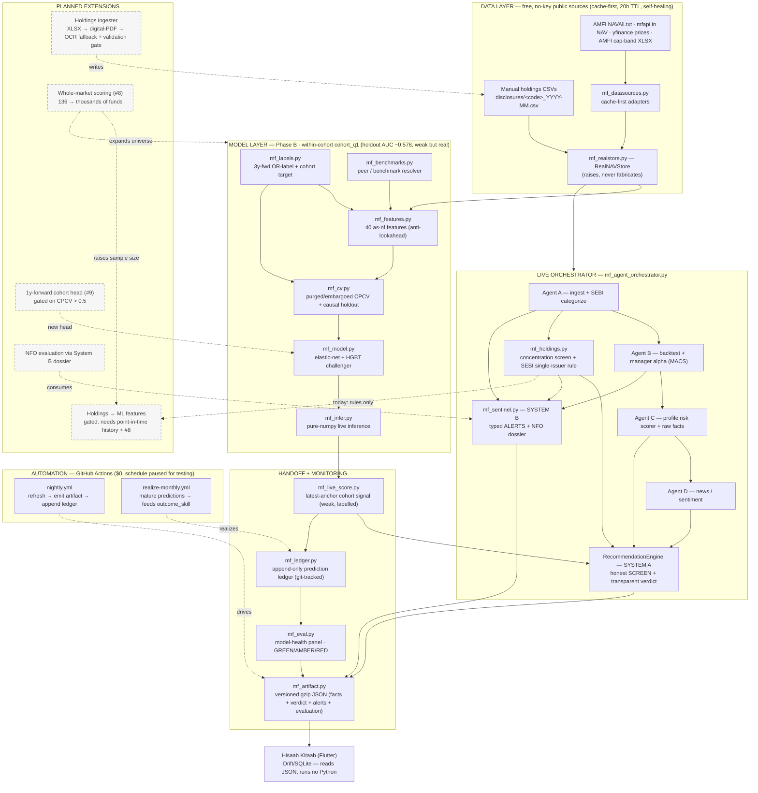

# Pipeline architecture

A NAV-only Indian mutual-fund **screening** tool (not a skill-verified buy engine). It
fetches free public data, computes honest quant/compliance facts per fund, and hands a
versioned JSON artifact to the Hisaab Kitaab Flutter app. Solid = built; **dashed =
planned**. The load-bearing rule throughout is the **honesty invariant**: missing data
is a coverage flag (never a pass), no fabricated accuracy, no invented facts.

## How to read it

- **Data → Model → Orchestrator → Handoff → App** is the main spine. The model layer
  (Phase B) trains offline; the orchestrator scores live and fuses everything into the
  two products below.
- **System A** (`RecommendationEngine`) = the honest SCREEN: raw NAV facts + a
  transparent 🟢BUY / 🔵HOLD / 🔴SELL verdict (a rule over colour-coded metrics + hard
  compliance gates), now including the **holdings concentration** metric and the
  **SEBI single-issuer** breach gate from `mf_holdings.py`.
- **System B** (`mf_sentinel.py`) = typed compliance/factor/manager ALERTS + NFO
  dossier — flags with evidence, never a fund score.
- **Monitoring**: every live cohort prediction is logged to the git-tracked
  `mf_ledger`; `mf_eval` grades drift/stability/coverage/outcome into an app-facing
  `evaluation{}` health panel. `outcome_skill` stays **PENDING** until predictions
  mature (~2029) — the framework refuses to fake accuracy before then.
- **Automation**: `nightly.yml` refreshes data + re-emits the artifact + appends the
  ledger; `realize-monthly.yml` matures predictions. Both schedules are **paused**
  (manual dispatch only) pending first-run testing.

## Planned extensions (dashed)

| # | Extension | Blocker / gate |
|---|---|---|
| P1 | Holdings ingester (XLSX→PDF→OCR + validation gate) | brittle per-AMC parsing; value is the validation gate, not the model |
| P2 | Whole-market scoring (#8) | category normalization + `OUT_OF_TRAINING_UNIVERSE` flag |
| P3 | Holdings **as ML features** | needs point-in-time holdings history + P2 for sample size; can't be backfilled → deliberately kept out of `cohort_q1` today (holdings drive *rules* only) |
| P4 | 1y-forward cohort head (#9) | ships only if it clears CPCV > 0.5 post-P2 |
| P5 | NFO evaluation via System B dossier | manager-proxy from cross-fund holdings |
